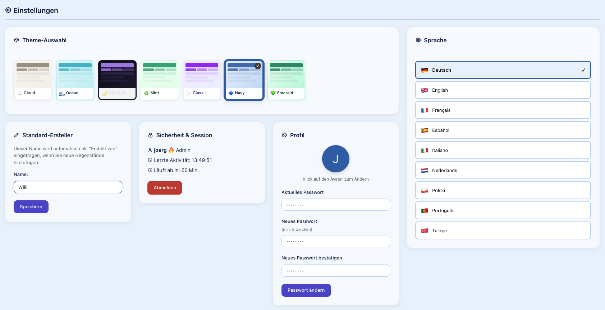
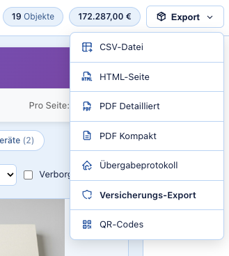

# ValuSafe

Selbst gehostete Inventarverwaltung für Wertsachen. Sie erfassen, was Sie besitzen — mit Foto, Kaufpreis und Standort — und ValuSafe macht daraus Übersichten, Auswertungen und die Unterlagen, nach denen eine Versicherung nach einem Einbruch, einem Brand oder einem Wasserschaden fragt.

Dasselbe taugt für Sammlungen — Gitarren, Uhren, Bücher, Kunst — und für die Wohnungsübergabe: Das Übergabeprotokoll listet alles Raum für Raum auf, mit Angaben zu Mieter und Vermieter, zum Ausdrucken und Unterschreiben.

Es läuft auf gewöhnlichem Webhosting. Kein Framework, kein Composer, kein Node, keine fremden Server: Dateien hochladen, Assistenten durchklicken, fertig.

**Stand:** 09.2026 · *(English version: [README.md](README.md))*

## Warum es das gibt

Nach einem Schaden stellt die Versicherung drei Fragen: Was hatten Sie, was war es wert, und können Sie es belegen. Wer das Wochen später aus dem Gedächtnis beantwortet, bekommt am Ende zu wenig. ValuSafe gibt es, damit die Antwort schon geschrieben ist — und damit das, was Sie einreichen, wie ein Dokument aussieht und nicht wie ein Schuhkarton voller Kassenzettel.

## Was es kann

- **Gegenstände** mit Foto, Kaufdatum, Kaufpreis, aktuellem Wert, Standort, Notizen und zwei freien Feldern
- **Mehrere Bilder und Dokumente** je Gegenstand — Rechnungen, Zertifikate, Gutachten
- **Wertverlauf** — der aktuelle Wert wird über die Zeit geführt, nicht überschrieben
- **Standorte** als Räume, Orte und Positionen, damit „wo ist es" eine Antwort hat
- **Versicherungen** mit zugeordneten Gegenständen
- **Barcode-Scan** im Browser, mit Nachschlagen für Bücher und Medien
- **Exporte**: PDF (darunter ein Versicherungsbericht und ein Übergabeprotokoll), CSV, HTML, QR-Codes zum Aufkleben
- **Übersichtsseite** mit Auswertungen nach Kategorie, Raum und Wert
- **Benutzer und Rollen** (admin, edit, read) samt feiner Rechtematrix
- **Zwei-Faktor-Anmeldung** (TOTP nach RFC 6238)
- **Datensicherung** von Datenbank, Bildern und Programmdateien, mit Wiederherstellung
- **Neun Sprachen**: Deutsch, Englisch, Französisch, Spanisch, Italienisch, Niederländisch, Polnisch, Portugiesisch, Türkisch
- **Sieben Farbschemata** zur Auswahl, darunter ein dunkles, gegen die WCAG-Kontrastregeln geprüft
- **Änderungsverlauf** — wer hat was wann geändert

## Ein paar Ansichten

Ein Gegenstand mit Wertverlauf, eigenen Feldern und angehängten Bildern:

Versicherungen, mit den zugeordneten Gegenständen und der Summe je Vertrag:

Farbschema und Sprache wählt jeder Benutzer für sich:

Was sich aus einer Auswahl herausholen lässt:

*Die Bilder stammen aus dem Demo-Inventar; die Gegenstände und ihre Abbildungen sind erfunden.*

## Voraussetzungen

- PHP 8.2 oder neuer
- MySQL 8 oder MariaDB
- Apache mit `.htaccess`, oder ein gleichwertiger Regelsatz auf einem anderen Webserver
- Etwa 50 MB Platz, dazu Platz für Ihre Fotos

Kein Shell-Zugang nötig. Kein Composer, kein Bauschritt, kein Hintergrundprozess.

## Installation

**Auf einem Webspace:** Den Inhalt von `wert/` in das Webverzeichnis hochladen und `setup.php` und `schema.sql` aus `install/` daneben legen — in dasselbe Verzeichnis wie `index.php`, nicht in einen Unterordner. Dann `setup.php` im Browser aufrufen und dem Assistenten folgen. Er prüft PHP-Version und Erweiterungen, legt die Datenbank an und schreibt die `config.php`. Am Ende löscht er sich selbst und `schema.sql`; gelingt ihm das nicht, sagt er es, und Sie entfernen beides von Hand.

Das fertige Paket von [palindrom.de/valusafe](https://palindrom.de/valusafe/) ist bereits so aufgebaut und enthält zusätzlich die Handbücher.

**Mit Docker:** siehe [docker/INSTALL.de.md](docker/INSTALL.de.md) — `docker compose up`, nachdem eine `.env` ausgefüllt ist. Die Anleitung behandelt auch die Fälle, in denen es schiefgeht.

## Ihre Daten bleiben bei Ihnen

ValuSafe hat keine Telemetrie, meldet nichts nach Hause und zählt keine Zugriffe. Chart.js, die Barcode-Bibliothek und die Symbolschrift liegen auf Ihrem eigenen Server, nicht bei einem Anbieter.

Es gibt genau eine Funktion, die nach außen geht, und sie ist freiwillig: Wenn Sie einen Barcode oder eine ISBN nachschlagen lassen, fragt der Server öffentliche Produktdatenbanken ab — Open Library, Google Books, UPCitemdb, Open Food Facts, Open Beauty Facts — und zwar mit dem Code, den Sie gescannt haben. Mehr wird nicht übermittelt, und wer diesen Knopf nie benutzt, bei dem verlassen keine Inventardaten den eigenen Server. Das Scannen selbst geschieht im Browser. Sonst geht nur E-Mail hinaus, und nur, wenn Sie die Funktionen benutzen, die sie verschicken: Passwort zurücksetzen, das Kontaktformular der öffentlichen Ansicht, Hinweise zur Sicherung. Alles andere funktioniert auch auf einem Rechner ganz ohne Internetverbindung.

## Sicherheit

Passwörter werden mit Argon2id gehasht. Jede Datenbankabfrage benutzt vorbereitete Anweisungen ohne Emulation. Formulare tragen CSRF-Token, die Sitzung wird bei der Anmeldung neu vergeben und trägt einen Fingerabdruck, Anmeldeversuche werden begrenzt und sperren zeitweise, Uploads werden nach MIME-Typ geprüft und Bilder neu kodiert, und die HTTP-Kopfzeilen enthalten HSTS und eine Content Security Policy, die keine fremden Server zulässt. Eingebettete Skripte und Stile erlaubt sie noch; die Seiten sind darauf angewiesen.

Wenn Sie ein Sicherheitsproblem finden: In [SECURITY.de.md](SECURITY.de.md) steht, wohin damit und was Sie erwarten dürfen — und, ehrlicherweise, was nicht.

## Unterlagen

| Datei | Was drinsteht |
|---|---|
| [ARCHITECTURE.de.md](ARCHITECTURE.de.md) | Wie der Code aufgebaut ist, aus dem Quelltext rekonstruiert und nicht aus der Erinnerung |
| [SECURITY.de.md](SECURITY.de.md) | Sicherheitsmeldungen, Geltungsbereich, was ausdrücklich nicht dazugehört |
| [docker/INSTALL.de.md](docker/INSTALL.de.md) | Docker-Installation, Schritt für Schritt |
| [changelog_vollstaendig.txt](changelog_vollstaendig.txt) | Alle Änderungen, die Anwender betreffen |
| [CHANGELOG.md](CHANGELOG.md) | Dasselbe auf Englisch, ab Version 4.3.28 |
| [doku/Benutzerhandbuch_v4_2_3.pdf](doku/Benutzerhandbuch_v4_2_3.pdf) | Benutzerhandbuch — Stand 4.2.3, also älter als die aktuelle Fassung |
| [doku/Benutzerhandbuch_Erweitert_v4_2_3.pdf](doku/Benutzerhandbuch_Erweitert_v4_2_3.pdf) | Erweitertes Handbuch, gleicher Stand |
| [THIRD-PARTY-NOTICES.md](THIRD-PARTY-NOTICES.md) | Mitgelieferte fremde Bestandteile und ihre Lizenzen |

## Stand, und was Sie erwarten können

ValuSafe wird von einer einzelnen Person geschrieben und gepflegt, einem pensionierten Informatiklehrer, in seiner Freizeit. Die Entwicklung begann Ende 2025; elf Installationen sind im täglichen Einsatz.

Was das für Sie bedeutet, ohne Beschönigung:

- **Es wird gepflegt, aber es gibt keine Zusage auf Unterstützung.** Kein Servicevertrag, keine Rufbereitschaft, keine zugesagte Antwortzeit.
- **Korrekturen gibt es nur für die aktuelle Fassung.** Ältere Versionen werden nicht nachgepflegt.
- **Es gibt Altlasten.** Der Code ist über ein Jahr gewachsen, und das sieht man — [ARCHITECTURE.de.md](ARCHITECTURE.de.md) führt die bekannten Schwachstellen ehrlich auf. Die größte Altlast, drei konkurrierende Modelle für Räume und Standorte, wurde im September 2026 bereinigt (Versionen 4.3.24 und 4.3.25).
- **Den Verzeichnisschutz macht die `.htaccess`.** Auf einem Webserver, der sie nicht liest — etwa Nginx — müssen Sie die gleichwertigen Regeln selbst schreiben. Ein Nginx-Regelsatz liegt noch nicht bei.

Fehlermeldungen und Fragen sind willkommen. Beiträge ebenfalls — nur kann ein einzelner Entwickler nicht versprechen, wann er dazu kommt.

## Lizenz

MIT — siehe [LICENSE](LICENSE). Mitgelieferte fremde Bestandteile behalten ihre eigene Lizenz, siehe [THIRD-PARTY-NOTICES.md](THIRD-PARTY-NOTICES.md).
