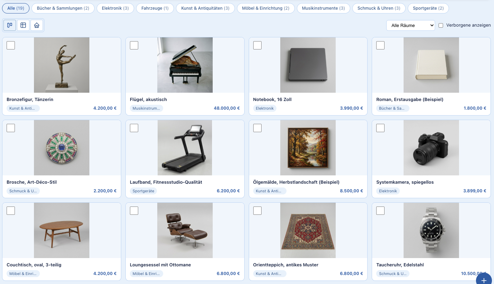
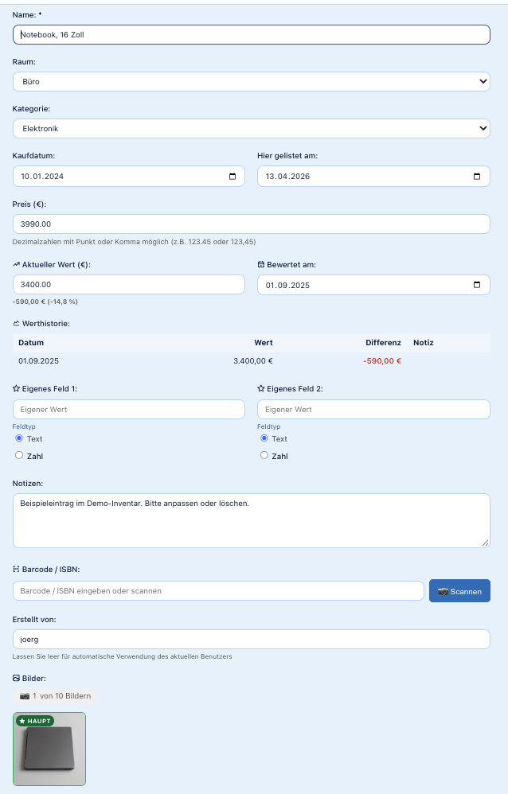
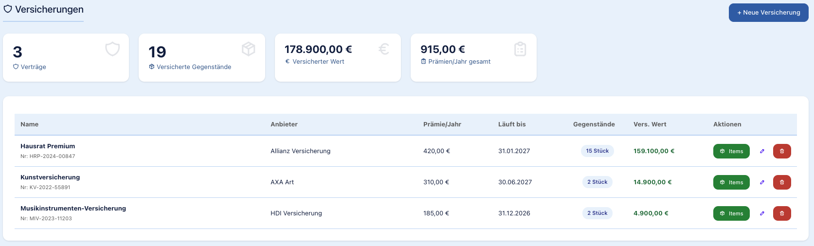
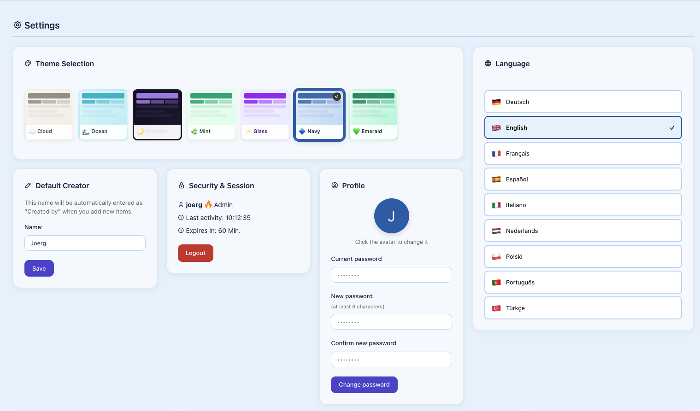
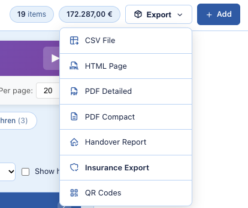

# ValuSafe

Self-hosted inventory management for valuables. You record what you own — with photos, purchase price and location — and ValuSafe turns it into overviews, charts and the kind of documentation an insurer asks for after a burglary, a fire or a flood.

The same works for collections — guitars, watches, books, art — and for moving in or out of a rental: the handover report lists everything room by room, with fields for tenant and landlord, ready to print and sign.

It runs on ordinary shared hosting. No framework, no Composer, no Node, no external CDN: upload the files, run the setup wizard, done.

**Stand:** 09.2026 · *(German version: [README.de.md](README.de.md))*

## Why it exists

Insurers ask three questions after a loss: what did you own, what was it worth, and can you prove it. Answering them from memory, weeks after the event, is how people end up underpaid. ValuSafe exists so the answer is already written down — and so the export you hand over looks like a document rather than a shoebox of receipts.

## Features

- **Items** with photo, purchase date, purchase price, current value, location, notes and two free-form fields
- **Multiple images and documents** per item — receipts, certificates, appraisals
- **Value history** — the current value is kept over time, not overwritten
- **Locations** as rooms, places and positions, so "where is it" has an answer
- **Insurance policies** with items assigned to them
- **Barcode scanning** in the browser, with lookup for books and media
- **Exports**: PDF (including an insurance report and a handover report), CSV, HTML, printable QR code labels
- **Dashboard** with charts by category, room and value
- **Users and roles** (admin, edit, read) plus a fine-grained permission matrix
- **Two-factor authentication** (TOTP, RFC 6238)
- **Backups** of database, images and application files, with restore
- **Nine languages**: German, English, French, Spanish, Italian, Dutch, Polish, Portuguese, Turkish
- **Seven themes** to choose from, one of them dark, checked against WCAG contrast rules
- **Activity log** — who changed what, and when

## A few views

An item with its value history, custom fields and attached images:

Insurance policies, with the items assigned to each and the sum per contract:

Theme and language are chosen per user:

What you can get out of a selection:

*The screenshots come from the demo inventory; the items and their pictures are made up. The demo data is German, so the list, item and insurance views show German names; settings and export menu are shown with the English interface.*

## Requirements

- PHP 8.2 or newer
- MySQL 8 or MariaDB
- Apache with `.htaccess` support, or an equivalent rule set on another web server
- About 50 MB of disk space plus room for your photos

No shell access needed. No Composer, no build step, no background worker.

## Installation

**On a webspace:** upload the contents of `wert/` into your web directory and put `setup.php` and `schema.sql` from `install/` next to them — in the same directory as `index.php`, not in a subfolder. Then open `setup.php` in a browser and follow the wizard. It checks the PHP version and extensions, creates the database schema and writes `config.php`. At the end it deletes itself and `schema.sql`; if it cannot, it says so and you remove both by hand.

The ready-made package from [palindrom.de/valusafe](https://palindrom.de/valusafe/) is already laid out this way, and it also contains the user manuals.

**With Docker:** see [docker/INSTALL.de.md](docker/INSTALL.de.md) — `docker compose up` after filling in a `.env` file. The guide is in German and covers the failure cases that actually happen.

## Your data stays yours

ValuSafe has no telemetry, no phone-home and no analytics. Chart.js, the barcode library and the icon font are served from your own server, never from a CDN.

There is exactly one outward-facing feature, and it is optional: when you look up a barcode or an ISBN, the server queries public product databases — Open Library, Google Books, UPCitemdb, Open Food Facts, Open Beauty Facts — with the code you scanned. Nothing else about your inventory is sent, and if you never use that button, none of your inventory data leaves your server. Scanning itself happens in the browser. The only other traffic is e-mail, if you use the features that send it: password reset, the contact form of the public view, backup notifications. Everything else works on a machine with no internet connection at all.

## Security

Passwords are hashed with Argon2id. Every database query uses prepared statements with emulation switched off. Forms carry CSRF tokens, sessions are regenerated on login and carry a fingerprint, logins are rate-limited with a lockout, uploads are checked by MIME type and images are re-encoded, and the HTTP headers include HSTS and a Content Security Policy that allows no foreign hosts. The CSP still permits inline scripts and styles; the pages rely on them.

If you find a security problem, [SECURITY.md](SECURITY.md) says where to report it and what to expect — including, honestly, what not to expect.

## Documentation

| File | What is in it |
|---|---|
| [ARCHITECTURE.md](ARCHITECTURE.md) | How the code is built, reconstructed from the source rather than from memory |
| [SECURITY.md](SECURITY.md) | Reporting security issues, scope, what is out of scope |
| [docker/INSTALL.de.md](docker/INSTALL.de.md) | Docker installation, step by step (German) |
| [CHANGELOG.md](CHANGELOG.md) | Changes that affect users, in English, from version 4.3.28 on |
| [changelog_vollstaendig.txt](changelog_vollstaendig.txt) | Every change that affects users, all versions (German) |
| [doku/Benutzerhandbuch_v4_2_3.pdf](doku/Benutzerhandbuch_v4_2_3.pdf) | User manual (German) — as of version 4.2.3, older than the current release |
| [doku/Benutzerhandbuch_Erweitert_v4_2_3.pdf](doku/Benutzerhandbuch_Erweitert_v4_2_3.pdf) | Extended manual (German), same vintage |
| [THIRD-PARTY-NOTICES.md](THIRD-PARTY-NOTICES.md) | Bundled third-party components and their licenses |

## Status, and what to expect

ValuSafe is written and maintained by one person, a retired computer science teacher, in his spare time. Development started at the end of 2025; eleven installations are in production use.

What that means for you, stated plainly:

- **It is maintained, but there is no support promise.** No service level, no on-call, no guaranteed response time.
- **Only the current version gets fixes.** There are no backports to older releases.
- **There is legacy inside.** The code has grown over a year and it shows — [ARCHITECTURE.md](ARCHITECTURE.md) lists the known weak spots, honestly. The largest piece of legacy, three competing models for rooms and locations, was cleaned up in September 2026 (versions 4.3.24 and 4.3.25).
- **`.htaccess` does the directory protection.** On a web server that ignores `.htaccess` — Nginx, for instance — you have to write the equivalent rules yourself. An Nginx rule set is not yet included.

Bug reports and questions are welcome as issues. Pull requests are welcome too, but a single maintainer cannot promise when he will get to them.

## License

MIT — see [LICENSE](LICENSE). Bundled third-party components keep their own licenses; see [THIRD-PARTY-NOTICES.md](THIRD-PARTY-NOTICES.md).
